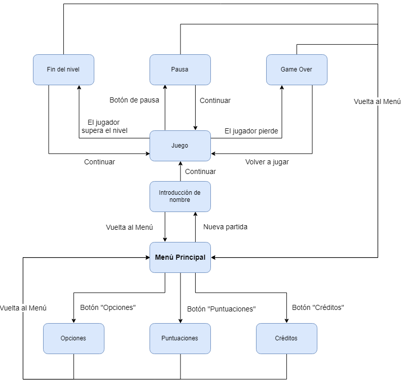

# Timmy is Happy

* * *

## Game Design Document

# Índice

* 1\. [Introduccion](#introduccion)
  + 1.1\. [Concepto](#Concepto)
  + 1.2\. [Características principales](#Caracteristicasprincipales)
  + 1.3\. [Género](#Genero)
  + 1.4\. [Estilo Visual](#EstiloVisual)
  + 1.5\. [Alcance](#Alcance)
  + 1.6\. [Jugabilidad](#Jugabilidad)
  + 1.7\. [Propósito y público objetivo](#Propositoypublicoobjetivo)
* 2\. [Mecánicas del juego](#mecanicas)
  * 2.1\. [Jugabilidad](#Jugabilidad)
  * 2.2\. [Trampas](#Trampas)
  * 2.3\. [Flujo de juego (Game Loop)](#Flujodejuego(GameLoop))
  * 2.4\. [Personajes](#Personajes)
  * 2.5\. [Movimiento](#Movimiento)
  * 2.6\. [Cámara](#Camara)
  * 2.7\. [Controles](#Controles)
  * 2.8\. [Niveles](#Niveles)
* 3\. [Interfaz](#interfaz)
  * 3.1\. [Diagrama de Flujo](#DiagramadeFlujo)
  * 3.2\. [Pantalla de Menú Principal](#PantalladeMenuPrincipal)
  * 3.3\. [Pantalla de Puntuaciones](#PantalladePuntuaciones)
  * 3.4\. [Pantalla de Créditos y Contacto](#pantalladeCreditosyContacto)
  * 3.5\. [Pantalla de Nivel](#PantalladeNivel)
  * 3.6\. [Pantalla de Fin de Nivel (Game Over)](#PantalladeFindeNivel(GameOver))
* 4\. [Arte y Sonido](#arteysonido)
  * 4.1\. [Arte](#Arte)
  * 4.2\. [Sonido](#Sonido)
* 5\. [Roles](#roles)

</ol>

# 1. Introducción 

***Timmy is happy*** es un videojuego de navegador, con estética 2D y de un único jugador, desarrollado en base al consorcio W3C (JavaScript, CSS y HTML). En este documento se van a plasmar los aspectos relacionados con el diseño fundamental del videojuego, de forma que nos sirva como carta de presentación ante futuros colaboradores.

</>

## **1.1. Concepto**

*El joven **Timmy** anda contento y** despistado por la ciudad. **Pero** parece que no va a ser un buen día para él. A no ser… ¡que puedas evitarlo! Al fin y al cabo, eres un todopoderoso Dios…*

Nuestro protagonista, Timmy, es un joven alegre y despistado, que va paseando de forma poco cuidadosa por la ciudad. Ante su camino, se presentan diversas amenazas o trampas (un coche, una alcantarilla abierta, etc.) que ponen en peligro su bienestar. Pero no hay motivo para preocuparse, pues el jugador, que se sitúa en el papel de Dios bondadoso y omnipotente, vela por el joven muchacho, desactivando las trampas a medida que van apareciendo. ¿Conseguirá Timmy dar su paseo de forma segura, o caerá presa de los innumerables peligros de la apacible ciudad? 

El modelo estructural del videojuego será el de un "Infinite Runner" en el que se juega con un solo click, y donde el jugador deberá parar las amenazas o trampas que intentan hacer que Timmy tenga un mal día. 

Es un juego de estética 2D para navegador, en PC y dispositivos móviles, con coloridos gráficos y animaciones, e infinidad de horas jugables.

</>

## 1.2. Características principales

* **Controles sencillos**: Solo se requiere un toque en la pantalla o un click de ratón para jugar, lo que facilita una curva de aprendizaje intuitiva.

* **Jugabilidad extensible**: Sistema de niveles y flujo de juego acorde a ellos, lo cual otorga al juego de alta escalabilidad para añadir contenido en un futuro.

* **Cómodo:** en cualquier dispositivo móvil, al igual que en el navegador del PC, gracias a la sencillez de los controles mencionados.

* **Temática divertida:** la naturaleza de la premisa del juego, así como de la sencillez de sus mecánicas, dan lugar a una dinámica final que busca provocar la sonrisa en el jugador, al mismo tiempo que atraparle en su jugabilidad.

</>

## 1.3. Género

El género del juego es un "Infinite Runner", donde el personaje se mueve infinitamente en un escenario, que habitualmente se genera de forma modular y procedural. 

En este caso, sin embargo, se acompañará con escenarios prefabricados, para poder ofrecer un reto constante que no dependa exclusivamente de la aleatoriedad para funcionar (ya que a menudo los algoritmos de este tipo de juegos resultan algo injustos por su carácter aleatorio). Un ejemplo similar de "Infinite Runner" sería el minijuego del T-Rex que aparece en la ventana de Google Chrome cuando no hay conexión a la red.

</>

## 1.4. Estilo Visual

La estética tendrá un estilo visual de temática cartoon, no realista, y será generalmente de aspecto amigable, colores pintorescos y animaciones exageradas, y contará con un arte propio y diferenciable.

</>

## 1.5. Alcance

La idea principal del juego radica en la escalabilidad. La versión básica consistirá en un juego pequeño pero fácilmente escalable, para poder permitir una longeva vida del videojuego, si este tiene éxito comercial.

Esta escalabilidad es posible gracias al sistema de niveles del juego, de forma que, en un futuro y si efectivamente el juego tiene cierto renombre, se pueden incluir nuevos niveles, dinámicas, estilos, etc.

</>

## 1.6. Jugabilidad

Los niveles serán realizados de forma progresiva y estarán colocados de manera contigua, de forma que, aunque son niveles independientes, serán tratados como un único mapa infinito. Tendremos las siguientes características:

* **Dificultad incremental:** con cada nivel, en un formato típico de los "Infinite Runner" (cada vez un poco más rápido, mayor número de amenazas, etc.).

* **Diferentes trampas**: Harán que el jugador tenga que estar atento a distintas partes de la pantalla, debido a que las amenazas aparecen por zonas diferentes del escenario, no en un mismo lugar, lo que evita que el jugador se estanque en un patrón y el juego se vuelva aburrido.

* **No controlamos a Timmy**: seremos una entidad o deidad que tendrá que limpiar el camino para Timmy, a quien debemos proteger de su propio despiste.

Para la actual fecha límite, el objetivo es preparar con éxito **3 niveles.**

</>

## 1.7. Propósito y público objetivo

Nuestro objetivo es obtener un juego 2D, de estética atractiva y llamativa, rápido, dinámico y simple (que se pueda jugar con una sola mano), que sirva para entretener durante los momentos aburridos del jugador.

Es un juego apto para todos los públicos, tanto para los amantes de los juegos de móvil como para un perfil de jugador más ocasional o "casual", y disfrutable en cualquier momento (en viajes, en casa, etc). Nuestro objetivo sería cumplir un PEGI 12, puesto que hay violencia no implícita ni mostrada, pero de hecho su temática funciona sobre dicha violencia tanto del jugador hacia las “trampas” (mover un coche) como de las propias trampas (el coche va hacia Timmy).

</>

# 2. Mecánicas del juego

En esta sección, trataremos todas las cuestiones referentes al funcionamiento básico y avanzado del juego, así como las distintas trampas que aparecen en el escenario, y se explicarán controles, mapa y desarrollo de la "partida típica".

</>

## 2.1. Jugabilidad

* **Niveles:** los niveles del juego consistirán en una ciudad en distintos momentos del día (mediodía, de noche, etc.), de forma que empezaremos en un momento del día determinado, al terminar, pasaremos al siguiente nivel, en otro momento del día, y así sucesivamente. Cada momento del día, es decir, cada nivel, tendrá unas características algo distintas al resto.

* **Dificultad:** la dificultad irá aumentando con cada nivel, de forma que el nivel de noche, por ejemplo, será más complicado que el de mediodía. Así, nos ajustamos al modelo de "Infinite Runner", en el cual la dificultad aumenta cuanto más juegas, para que sea un reto cada vez mayor.

* **Trampas:** los niveles tendrán trampas o amenazas distribuidas por el escenario. Inicialmente, algunas trampas aparecerán activadas, y otras desactivadas. Al hacer click sobre una trampa, esta cambiará al estado opuesto (si estaba activada, se desactiva, y viceversa), y ya no podrá volver a ser cambiada. Por ello, deberá tenerse cuidado antes de interactuar con ellas, y pensar antes de actuar. Entre las trampas principales, encontramos:

<table>
  <tr>
    <td>Nombre</td>
    <td>Rango</td>
    <td>Efecto</td>
  </tr>
  <tr>
    <td>Alcantarilla</td>
    <td>Suelo</td>
    <td>Cambia su estado a abierta o cerrada.</td>
  </tr>
  <tr>
    <td>Coche</td>
    <td>Medio</td>
    <td>Avanza rápidamente hacia Timmy.</td>
  </tr>
  <tr>
    <td>Caca de perro</td>
    <td>Suelo</td>
    <td>Es estático. Al pulsar 2 veces desaparece. </td>
  </tr>
  <tr>
    <td>Paloma</td>
    <td>Aire</td>
    <td>Lanza un proyectil letal hacia abajo.</td>
  </tr>
  <tr>
    <td>Avión/Helicóptero</td>
    <td>Aire</td>
    <td>Obstruye la visión aérea. Se necesita quitar para eliminar otras trampas aéreas.</td>
  </tr>
  <tr>
    <td>Perro enfadado</td>
    <td>Medio</td>
    <td>Ladra 3 veces y después se lanza contra Timmy</td>
  </tr>
</table>

* **Progresión del jugador:** finalmente, los esfuerzos del jugador se verán recompensados en forma de puntos y total de niveles completados (agrupados en días, cada 3 niveles constituyen un día). Este sistema animará al jugador a volver a jugar otra partida para superar su puntuación o la de sus amigos, asegurándonos de que el jugador siempre recurra al juego para buscar un reto mayor.

</>

## **2.2. Trampas**

El núcleo de la jugabilidad serán las trampas. Los niveles tendrán un número determinado y asignado previamente de amenazas distribuidas por el escenario. La funcionalidad básica es el toque o la repetición de toques en la trampa para eliminarla o cambiar su estado a uno positivo. A continuación se detalla la lista de trampas, así como su comportamiento y tratamiento. Todas ellas tienen animaciones asignadas y sonidos para notificar su existencia o eliminación al jugador, para no depender solo de su estímulo visual.

**Caca de perro**:

1.  *Funcionalidad*: Esta trampa aparece a nivel del suelo y permanece quieta (se mueve a velocidad del escenario) todo el rato.
2.  *Forma de neutralizar*: Un solo click la desactiva permanentemente.
3.  *Animaciones*: La caca al ser pulsada, se convierte en un bolsita negra al haberse recogido con éxito.
4.  *Arte:* Una caca de perro olorosa y una bolsita negra de plástico. 
5.  *Sonido*: Un sonido al aparecer y un sonido de guardar en bolsita al eliminarla.

**Alcantarilla:**

1.  *Funcionalidad*: Esta trampa aparece a nivel del suelo y permanece quieta (se mueve a velocidad del escenario). Aparece en uno de dos estados, abierta o cerrada. Si llega a Timmy abierta, se pierde el juego (se cae). Si llega cerrada, la partida continúa.
2.  *Forma de neutralizar*: No se puede eliminar, pero un click cambia su estado. La idea es hacer click si está abierta, y evitar hacer click si está cerrada.
3.  *Animaciones*: Abrirse y cerrarse.
4.  *Arte*: Una tapa de alcantarilla y su respectivo agujero.
5.  *Sonido*: Abrir y cerrar una alcantarilla.

**Perro**:

1.  *Funcionalidad:* El perro aparece a nivel medio y  se mueve a velocidad de escenario. No ataca al jugador, sino que gruñe una vez por segundo, hasta dos. Al tercer segundo, ladra. A cuarto segundo, realiza un sprint (yendo a 65 puntos de velocidad respecto del escenario)hacia el jugador, siendo muy difícil su eliminación. Si alcanza al jugador se pierde la partida.
2.  *Forma de neutralizar:* Una pulsación sobre el perro en cualquier momento causa su eliminación del mapa con una animación.
3.  *Animaciones:* Ladrar, esprintar al jugador, salir volando hacia una dirección arbitraria (aérea) mientras rota.
4.  *Arte*: Un perro.
5.  *Sonido:* gruñido, ladridos, impacto.

**Coche**:

1.  *Funcionalidad:* Esta trampa aparece a nivel medio y se mueve un poco más rápido que el escenario (a 20 unidades más de su velocidad), y si no es neutralizado, atropella a Timmy haciendo que se pierda la partida.
2.  *Forma de neutralizar*: Necesita de dos clicks para ser neutralizado.
3.  *Animaciones*: El coche avanzando, el coche volando en dirección arbitraria, mientras rota y se escala negativamente (viaja hacia el fondo del escenario).
4. *Arte*: Un coche parecido a un escarabajo.
5. *Sonido*: Motor de coche, claxon.

**Paloma**:

1.  *Funcionalidad*: Esta trampa aparece a nivel alto y avanza a una velocidad ligeramente mayor al escenario (10 unidades más rápido que el escenario). El jugador pierde si se acerca mucho al jugador.
2.  *Forma de neutralizar*: Un solo click la neutraliza.
3.  *Animaciones*: Paloma volando, paloma volando en dirección arbitraria, cagarruta viajando hacia el jugador.
4.  *Arte:* Una paloma y su cagarruta al acercarse.
5.  *Sonido*: sonidos de Paloma y de plumas.

**Avión**:

1.  *Funcionalidad*: Esta trampa aparece a nivel alto y obstaculiza un tercio de la pantalla por la parte media superior izquierda de la pantalla, manteniéndose estático mientras vuela (no se mueve de la pantalla).
2.  *Forma de neutralizar*: Dos clicks neutralizan el avión.
3.  *Animaciones:* Avion volando hacia arriba, avión moviéndose en su sitio.
4.  *Arte*: Avión.
5.  *Sonido:* Turbinas del avión, avión accidentado.

</>

## 2.3. Flujo de juego (Game Loop)

El Game Loop estándar de una partida consistirá en lo siguiente:

* En el menú principal, el jugador puede ver puntuaciones o jugar. Si pulsa a jugar, comenzará el juego.

* Al iniciar la partida, se verá a Timmy andando, en la parte izquierda de la pantalla. Conforme avanza el escenario (Timmy permanece inmóvil en la zona izquierda, aunque da la sensación de estar andando porque se mueve el propio escenario) irán apareciendo diversos objetos, trampas o amenazas, que al contacto con Timmy harán que se pierda el juego.

* Al aparecer una trampa (como por ejemplo un coche en dirección a Timmy), el jugador tendrá unos pocos segundos para hacer click sobre dicho objeto, antes de que atraviese la mitad derecha de la pantalla, donde tiene todavía oportunidad de parar el accidente.

* Si el jugador hace click en el objeto, eliminará la amenaza y el juego continuará. Se sumarán puntos a un marcador en la zona superior izquierda de la pantalla.  Si, por otro lado, falla o no hace click sobre la amenaza, ésta llegará hasta Timmy, causando el fin del juego, y, por tanto, se mostrará en pantalla la puntuación obtenida durante la partida. Se notificará si la puntuación es la mayor conseguida hasta el momento, y se permitirá volver a jugar la partida o regresar al menú principal.

Además de trampas que hagan daño a Timmy y acaben el juego, también podrá haber objetos que entretengan al jugador o "protejan" una trampa, y deberán ser eliminados con anterioridad para poder desactivar la amenaza. Por ejemplo, de noche, habrá alguna farola apagada que necesitará ser encendida para ver que hay debajo, donde puede haber una trampa. 

También habrá trampas al revés, que sólo se activan si el jugador las pulsa. Si lo hace, estas trampas acabarán haciendo daño a Timmy y acabando el juego. Un ejemplo de esto sería una alcantarilla cerrada, a la cual el jugador hará click sin pensar (abriéndose y haciendo que Timmy caiga por ella), pues estará acostumbrado a tapar las alcantarillas abiertas, y sin embargo esta vez habrá creado él la amenaza en un descuido.

Si Timmy llega a un final de nivel sin haber sido alcanzado por ninguna amenaza, pasará por un túnel. Durante este túnel, se notificará de que se ha superado el nivel, se mostrarán los datos de puntuación del nivel, y al hacer click en la pantalla, se continuará al siguiente. Al continuar, Timmy seguirá andando por el túnel hasta la salida, donde comenzará el siguiente nivel, con un aumento de dificultad. Cada nivel será una hora del día, y cuando pasen 3, se cambiará. Se notificará el cambio de día y será parte de la puntuación (Por ejemplo "¡Perdiste! Has aguantado: 3 días. Puntos: 3500.").

</>

## 2.4. Personajes

* **Timmy**: Un chico despistado, que se nos muestra en pantalla paseando de forma distraída por la ajetreada ciudad. Siempre se mete en problemas por ir demasiado abstraído del mundo, y necesitaría un ángel de la guarda para no salir mal parado de sus problemas. Lo único que hace en el juego es andar de forma poco cuidadosa.

* **Dios**: El jugador tomará el papel de Dios, que gestionará las amenazas que intentan dañar a Timmy, intentando eliminarlas de su camino. Será, por lo tanto, un ser amable que intenta ayudar a Timmy en todo momento, incluso aunque ello suponga causar algo de caos en la ciudad. Se desconoce por qué solo quiere proteger a Timmy.

</>

## 2.5. Movimiento

El movimiento del juego consistirá en el scroll lateral de la pantalla de derecha a izquierda, estando Timmy en la zona izquierda de la misma, y apareciendo las amenazas por la derecha. No hay movimiento del jugador en sí, sino que se deberá hacer click o pulsar (en móviles) en las diversas amenazas que aparecen para ir eliminándolas.

Así, el único control como tal será el click o pulsación con el dedo, dependiendo del dispositivo, para hacer desaparecer (o aparecer) una amenaza. Esta sencillez en los controles nos permite, por un lado, crear una curva de aprendizaje asequible e intuitiva, y por otro, crear numerosas dinámicas jugables (activar trampa, desactivarla, activar una trampa de tipo indirecto, etc.) a partir de un mismo control.

</>

## 2.6. Cámara

La cámara en Timmy is Happy será fija, siendo visible todo el escenario, y solo será el escenario el que se mueva. Por lo tanto la cámara no es controlable.

</>

## 2.7. Controles

Los controles constan únicamente del click o pulsación de la pantalla en móvil sobre la región de la pantalla. Por lo tanto, pulsar sobre un objeto cambiará su estado (eliminar un objeto, etc.).

</>

## 2.8. Niveles

Durante Timmy is Happy, tendremos tres tipos de niveles distintos, en el que principalmente cambia la estética de los mismos. 

* *Mapa de Día:* El primer escenario y el escenario predeterminado, tendrá los enemigos más básicos y serán los niveles más sencillos desde un punto de vista de diseño, siendo introductorios a nuevos personajes o como tutorial.

* *Mapa de Tormenta:* Un punto medio en el que la dificultad aumenta y aparecen amenazas únicas de este tipo de mapas. Tendrán un tinte de lluvia que cubre el mapa y hacen un poco más difícil la visión del mapa.

* *Mapa de Noche:* Serían la dificultad máxima alcanzable, llevando enemigos más difíciles y surgiendo situaciones en las que la oscuridad obstruye la visión y es más difícil vislumbrar de las amenazas que vienen a por Timmy.

</>

# 3. Interfaz

</>

## 3.1. Diagrama de Flujo

A continuación, se muestra el diagrama de flujo y transición entre pantallas durante el desarrollo del juego:

## 

</>

## 3.2. Pantalla de Menú Principal

A continuación se muestra el esquema básico de la pantalla de Menú Principal:

 

</>

## 3.3. Pantalla de Puntuaciones

A continuación, se muestra el esquema básico de la pantalla de Puntuaciones:

</>

## 3.4. Pantalla de Créditos y Contacto

A continuación, se muestra el esquema básico de la pantalla de Contacto:

</>

## 3.5. Pantalla de Nivel

A continuación, se muestra el esquema básico de la pantalla de un nivel típico del juego:

*Al avanzar por el nivel, encontramos trampas.*

*Al hacer click en una trampa, ésta cambia su estado (en este caso se desactiva).*

*Tras un tiempo avanzando por el nivel, llegamos al final, y entramos en la pantalla de paso al siguiente nivel.*

</>

## 3.6. Pantalla de Fin de Nivel (Game Over)

A continuación se muestra el esquema básico de la pantalla de Game Over:

</>

# 4. Arte y Sonido

</>

## 4.1. Arte

El apartado artístico del videojuego será colorido y alegre, con un estilo de dibujado propio (en contraposición a Pixel Art), animaciones algo exageradas y, en general, una estética *cartoony*.

A continuación, se muestran algunos bocetos conceptuales:

El arte final se irá incorporando conforme se tengan los recursos necesarios.

</>

## 4.2. Sonido

Los sonidos del juego deberán acompañar a su estilo visual, de forma que deberán tener un toque alegre y divertido.

* *Boton_1*: Sonido para los botones de la aplicación, tales como los del menú.

* *Boton_2*: Un sonido alternativo para menús o requeridos.

* *Alcantarilla_Open*: Sonido de abrir la tapa de alcantarilla

* *Alcantarilla_Close*: Sonido de cerrar la tapa de alcantarilla.

* *Caca_Spawn*: Sonido de pisar una caca de perro para denotar la aparición de esta amenaza.

* *Caca_Eliminated*:Sonido de recogida en una bolsa de la caca de perro. Para cuando se elimina la trampa "Caca de perro".

* *Coche_Move*: Sonido loopeable del motor del coche cuando avance.

* *Coche_Bocina*: Un claxon cuando está muy cerca de Timmy.

* *Coche_Eliminated*: Un derrape para eliminar el coche de escena.

* *Paloma_Spawn*: Un sonido de paloma al spawnear, un gorjeo.

* *Paloma_Eliminated*: Manojo de plumas y aleteo cuando se elimina a la paloma.

* *Avion_Spawn*: Cuando el avión aparece en la escena.

* *Avion_Eliminated*: Suena el avión sobrevolar y estrellarse.

* *Avion_Loop*: Sonido loopeable del avión en escena.

* *Perro_Warn*: Un perro gruñendo y ladrando, para avisar de que va a atacaar.

* *Perro_Attack*: El perro ladra, cuando ataca.

* *Perro_Eliminated*: El perro huye, es eliminado.

</>

# 5. Roles

Para la realización del trabajo tendremos un equipo de 6 personas, siguiendo los siguientes roles:

* *Alejandro Camuñas Casas*: Diseñador de Juego y diseñador Web.

* *Andrés Felipe García*: Diseñador y programador Web.

* *Jose Daniel Campos Galán*: Programador Web.

* *Pablo Rodriguez Vicente*: Programador Web.

* *Raquel Gastón Vicente*: Artista 2D.

* *Guillermo Amigó Urda*: Diseñador de Juego y diseñador de Sonido.

